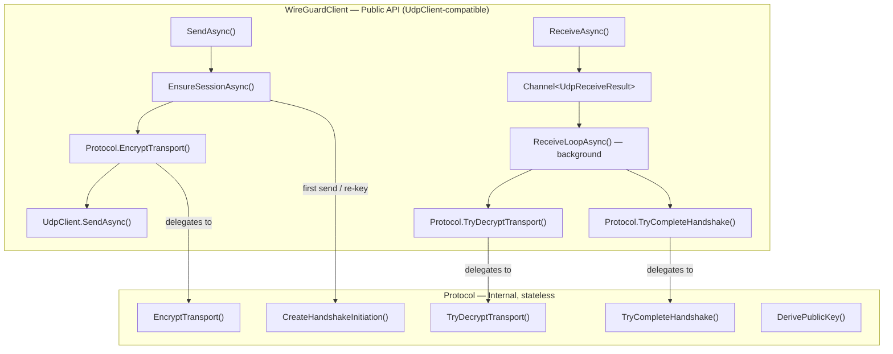
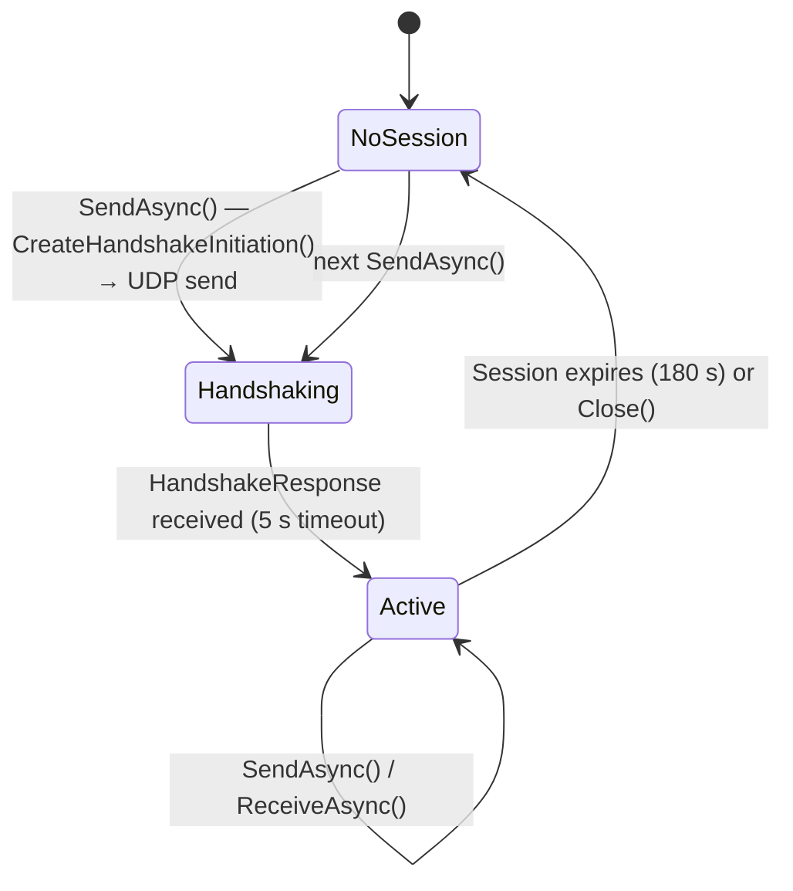

# Architecture

This document describes the internal design of `Proxylity.WireGuardClient`.

## Overview

The library exposes a single public class, `WireGuardClient`, that wraps a UDP socket with WireGuard's handshake and transport-encryption layers. The cryptographic core lives in a separate internal static class, `Protocol`, which is stateless and can be tested independently of any I/O.

## WireGuardClient State Machine

State transitions are guarded by a `SemaphoreSlim` (`_stateLock`) to prevent concurrent re-key races when multiple callers call `SendAsync` simultaneously.

## Key Types

### `WireGuardClient`

The public facade. Owns:
- A `UdpClient` (created internally or injected via the second constructor overload)
- A `Channel<UdpReceiveResult>` that buffers decrypted datagrams for `ReceiveAsync`
- The current `SessionState?` and `PendingHandshake?`
- A background `ReceiveLoopAsync` task that reads UDP packets, filters by endpoint, and routes them to the handshake or transport handler

### `Protocol` (internal, static)

Pure-function implementation of the WireGuard cryptographic layer. No I/O, no mutable state. Every method is deterministic given its inputs, which is what makes `ProtocolHandshakeTests` and `ProtocolTransportTests` fully reproducible without any network or time dependency.

### `PendingHandshake` (internal record)

Captures ephemeral material at the moment the initiator packet is sent:
- Ephemeral X25519 key pair
- Chaining key (`Ck`) and handshake hash (`H`) snapshot
- Serialized initiation packet (available for retransmission)
- Local session index

### `SessionState` (internal record)

Carries live session material after a successful handshake:
- Sender / receiver index pair (used to route incoming packets)
- Sending and receiving ChaCha20-Poly1305 keys
- Monotonic sending counter; receiver counter for replay detection
- Expiry timestamp (creation time + 180 s)

## Protocol Details

The handshake follows the [WireGuard whitepaper](https://www.wireguard.com/papers/wireguard.pdf), specifically the **Noise\_IKpsk2** pattern with X25519, ChaCha20-Poly1305, and BLAKE2s:

1. **Initiator** constructs a `HandshakeInitiation` message:
   - Generates a fresh ephemeral X25519 key pair
   - Runs the Noise IKpsk2 pattern: DH mixing, KDF chaining, AEAD-encrypts the static public key and a TAI64N timestamp
   - Sends the 148-byte packet over UDP

2. **Responder** validates the initiation, generates its own ephemeral key pair, and replies with a `HandshakeResponse`

3. **Initiator** calls `TryCompleteHandshake()`:
   - Authenticates the response against the stored `PendingHandshake` material
   - Derives the final `(send_key, recv_key)` transport key pair
   - Promotes to `SessionState`; the pending handshake is discarded

4. **Transport** messages use ChaCha20-Poly1305 with a 64-bit counter as the nonce (little-endian in the low 8 bytes of the 12-byte nonce). The receiver enforces a strictly increasing counter to provide replay protection.

### Message types

| Value | Name | Direction |
|-------|------|-----------|
| 1 | `HandshakeInitiation` | Client → Server |
| 2 | `HandshakeResponse` | Server → Client |
| 3 | `CookieReply` | Server → Client (rate limiting; not yet handled) |
| 4 | `Transport` | Both directions |

## Dependencies

| Package | Reason |
|---------|--------|
| `NSec.Cryptography` | X25519 ECDH and ChaCha20-Poly1305 AEAD via libsodium. Provides constant-time, audited primitives without requiring direct P/Invoke. |
| `SauceControl.Blake2Fast` | BLAKE2s for the Noise KDF and MAC chains. Substantially faster than a managed implementation and does not depend on `System.Security.Cryptography.Blake2s`, which is not universally available across target runtimes. |

